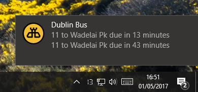

# dublin-bus-electron

This is a UI for the dublin bus API. Shows the time until the next bus, and also supports balloon notifications showing more upcoming busses when clicking the tray icon.



## Releases

The latest releases are available here:

TODO

## To Use

To clone and run this repository you'll need [Git](https://git-scm.com) and [Node.js](https://nodejs.org/en/download/) (which comes with [npm](http://npmjs.com)) installed on your computer. From your command line:

```bash
# Clone this repository
git clone https://github.com/alasdairhurst/dublin-bus-electron
# Go into the repository
cd dublin-bus-electron
# Install dependencies
npm install
# Run the app
npm start
```

Note: If you're using Linux Bash for Windows, [see this guide](https://www.howtogeek.com/261575/how-to-run-graphical-linux-desktop-applications-from-windows-10s-bash-shell/) or use `node` from the command prompt.

## Configuration

Currently, runtime configuration is not supported and will be available in an upcoming release.
The following parameters are hardcoded and can be changed before building.

```javascript
// The interval which to update the hover text for the system tray icon
const trayUpdateInterval = 1000 * 10;
// The interval which to fetch data from the API
const fetchInterval = 1000 * 60;
// Busses due before this time will not be displayed in the system tray. This will not effect balloon notifications. If there are no busses due at or after this time, the next bus will be displayed.
const trayIgnoreBefore = 8;
// The stop to get data for
const stopID = '878';
// the route to get data for. This can be set to null to get all busses for a stop.
const routeID = '11';
```

## To Build

Just run the following from the command line from the dublin-bus-electron repo:

```bash
npm run build
```
All platforms will be built.

## License

[CC0 1.0 (Public Domain)](LICENSE.md)
